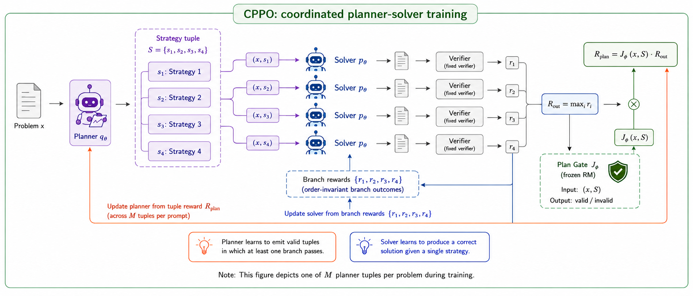

<div align="center">

# Cast a Wider Net

### Coordinated Pass@K Policy Optimization for Code Reasoning

**Yilong Li**<sup>1</sup> &nbsp;·&nbsp; **Suman Banerjee**<sup>1</sup> &nbsp;·&nbsp; **Tong Che**<sup>2,†</sup>

<sup>1</sup>University of Wisconsin–Madison &nbsp;&nbsp;·&nbsp;&nbsp; <sup>2</sup>NVIDIA Research

<sup>†</sup>Project lead, corresponding author

**EMNLP 2026**


</div>

<p align="center">
  
</p>

<p align="center">
<em><b>Figure 1.</b> The planner emits a strategy tuple <code>S = (s₁, …, s_K)</code>; the shared solver produces one
solution per strategy; a verifier returns per-branch outcomes. The outcome reward scores pass@K success and a
frozen reward model gates plan validity; the planner reward is their product. Solver tokens are updated from
within-tuple advantages, planner tokens from across-tuple advantages.</em>
</p>

---

> **Abstract.** Repeated sampling against a verifier is the standard way to allocate test-time compute for
> code generation, with pass@K as the canonical metric. Drawing $K$ independent samples from a single
> answer distribution, however, often produces near-duplicate reasoning paths and wastes the budget on
> redundant rollouts. This failure is costly in competitive programming, where many problems admit several
> distinct algorithmic strategies and pass@K requires only one correct attempt. We propose **Coordinated
> Pass@K Policy Optimization (CPPO)**, which trains a joint planner–solver policy for pass@K: a planner
> emits a tuple of $K{=}4$ alternative high-level methods, and a shared solver attempts one solution per
> method. We train it with a multiplicative planner reward,
> $R_{\text{plan}} = J_\psi \cdot R_{\text{out}}$, assigning credit only to valid strategy tuples that lead
> to verifier-confirmed pass@K success. Across APPS, CodeContests, and LiveCodeBench-v6, CPPO improves
> pass@4 over direct sampling, planning baselines, planner-only SFT, and pass@K-oriented RL under the same
> $K{=}4$ solver-attempt budget.

---

## Release status — upload in progress

> **This repository is being uploaded in stages.** The research is complete; what remains is packaging.
> The core method is here now, and the checkpoints, baselines, and remaining code follow as soon as we
> finish organizing them. Watch or star the repository to be notified.

What is already here covers the CPPO algorithm end to end: the plan-validity reward model, the sandboxed
verifier, and the entry points for all five training stages plus pass@K evaluation — enough to read the
method precisely and to train and evaluate on your own data.

| Component | Status |
| --- | :---: |
| Strategy-tuple rollout, split-region advantages, GRPO update | available |
| Plan-validity reward model: training, calibration, gating | available |
| Sandboxed verifier and code extraction | available |
| Planner SFT, warm-up, reward-density audit, joint CPPO, pass@K evaluation | available |
| Trained checkpoints (planner–solver, plan-validity RM) | uploading soon |
| Baseline implementations (PKPO, UpSkill, PlanSearch) | uploading soon |
| SFT data-construction funnel and judge prompts | uploading soon |
| Ablation tooling and figure-generation scripts | uploading soon |
| Run logs and evaluation manifests | uploading soon |

We redistribute no benchmark content: APPS, CodeContests, and LiveCodeBench-v6 stay with their original
sources under their own licenses.

Until the upload finishes, expect gaps — the checkpoint links in particular are not live yet. Issues and
questions are welcome in the meantime; if something you need is missing, open an issue and we will
prioritize it in the queue.

## Method

CPPO changes the policy factorization. Instead of drawing $K$ independent answers, the planner samples one
structured object — a tuple of $K$ strategy sketches generated autoregressively, so each method conditions
on its predecessors:

$$q_\Theta(S \mid x) = \prod_{i=1}^{K} q_\Theta(s_i \mid x, s_{\lt i}), \qquad y_i \sim p_\Theta(\cdot \mid x, s_i).$$

A sandboxed verifier $V$ scores each branch. The tuple-level outcome reward is the pass@K indicator, and a
frozen plan-validity model gates planner credit:

$$R_{\text{out}} = \mathbb{I}\left[\max_i V(x, y_i) = 1\right], \qquad J_\psi(x, S) = \mathbb{I}\left[p_\psi(\text{Pass} \mid x, S) \geq \tau\right], \qquad R_{\text{plan}} = J_\psi \cdot R_{\text{out}}.$$

The planner earns credit only when the tuple is well formed **and** at least one branch passes:
$R_{\text{out}}$ rejects valid but unsuccessful plans, while $J_\psi$ rejects successes obtained through
malformed, duplicated, or answer-leaking plans.

The two token regions carry different credit granularity. Solver advantages compare the $K$ branches within
one tuple; planner advantages normalize $R_{\text{plan}}$ across $M$ tuples sampled for the same prompt.
Both enter the standard clipped, KL-regularized GRPO objective, applied to disjoint token spans of one
shared backbone. A single backbone induces both factors through two prompt modes: the `PLAN` prompt produces
the strategy tuple, and the `SOLVE` prompt produces one answer conditioned on a single strategy.

Where each part of the paper lives in this code:

| Paper | Implementation |
| --- | --- |
| Strategy tuple $S$, Eq. (1)–(2) | [`cppo/data/prompts.py`](cppo/data/prompts.py) — `PLAN` contract and tuple parser |
| Verifier $V$ and outcome reward $R_{\text{out}}$ | [`cppo/sandbox/executor.py`](cppo/sandbox/executor.py) |
| Validity gate $J_\psi$, Eq. (5) | [`cppo/reward_model/`](cppo/reward_model), [`cppo/training/rewards.py`](cppo/training/rewards.py) |
| Planner reward $R_{\text{plan}} = J_\psi \cdot R_{\text{out}}$ | [`cppo/training/rollout.py`](cppo/training/rollout.py) — `assign_cppo_plan_rewards` |
| Split-region advantages, Eq. (7)–(8) | [`cppo/training/cppo_trainer.py`](cppo/training/cppo_trainer.py), [`cppo/training/advantages.py`](cppo/training/advantages.py) |
| GRPO objective, Eq. (9) | [`cppo/training/grpo.py`](cppo/training/grpo.py) |
| Warm-up reward $R_{\text{warm}} = J_\psi$ | [`cppo/training/warmup_trainer.py`](cppo/training/warmup_trainer.py) |

## Repository layout

```text
cppo/
├── data/          Problem schema, PLAN/SOLVE prompts, tuple parser, corpus loaders
├── sandbox/       Code extraction and the sandboxed verifier
├── reward_model/  Plan-validity RM: dataset, trainer, threshold calibration
├── training/      Rollout, rewards, split-region advantages, GRPO, CPPO/warm-up trainers
└── eval/          pass@K estimator

scripts/           One entry point per pipeline stage, numbered in run order
configs/           YAML for each stage; values follow Section 4 of the paper
```

## Installation

```bash
git clone git@github.com:jimmy-yilong-li/CPPO.git
cd CPPO
python -m venv .venv && source .venv/bin/activate
pip install -e .
```

Requires Python 3.10+ and PyTorch 2.1+. Training the 4B and 9B backbones needs one 80GB GPU per run; the
verifier runs on CPU.

## Models

All weights come from the official Hugging Face releases. The backbones and the reward model are **base**
checkpoints — CPPO performs its own SFT and RL on top of them.

| Role | Repository | Variant |
| --- | --- | --- |
| Planner–solver backbone | `Qwen/Qwen3.5-{2B,4B,9B}-Base` | base |
| Plan-validity reward model | `Qwen/Qwen3.5-0.8B-Base` | base |
| Offline judge (SFT filter) | `Qwen/Qwen3.5-9B-Instruct` | instruct |
| Generality check | `google/gemma-4-{e2b,e4b}-it` | instruct |

## Running the pipeline

The five stages of the paper map onto numbered scripts. Each consumes the artifacts of the previous one,
so run them in order.

```bash
# Stage 1 — Planner SFT on strict K=4 gold tuples
python scripts/01_train_planner_sft.py \
    --data <gold_tuples.jsonl> --output checkpoints/planner_sft

# Stage 2 — Plan-validity gate J_psi
python scripts/02_train_reward_model.py --config configs/reward_model.yaml

# Stage 3 — RM-guided planner warm-up under R_warm = J_psi
python scripts/03_run_warmup.py \
    --problems <codecontests_train.jsonl> \
    --rm-path checkpoints/reward_model \
    --config configs/warmup.yaml \
    --output checkpoints/warmup

# Stage 4 — Reward-density audit (forward-only; no parameter update)
python scripts/04_reward_density_audit.py \
    --problems <codecontests_train.jsonl> \
    --planner checkpoints/warmup \
    --rm-path checkpoints/reward_model

# Stage 5 — Joint CPPO
python scripts/05_run_cppo.py --config configs/cppo.yaml --base-config configs/base.yaml

# Evaluation — pass@K at a fixed attempt budget
python scripts/06_eval_pass_at_k.py --datasets apps codecontests livecodebench --k 4

# Larger budgets — one n=32 pool reports the whole 1/2/4/8/16/32 ladder
python scripts/06_eval_pass_at_k.py --datasets livecodebench \
    --k 32 --n-samples 32 --k-tuple 4
```

Budgets above the tuple size are reached by *pooling*, not by retraining a wider planner: one
$K_{\text{tuple}}{=}4$ planner is sampled `ceil(n_samples / k_tuple)` times and every branch joins a single
pool, from which `pass_at_k_sweep` reads off each rung of `1/2/4/8/16/32` that the pool supports. A rung is
reported only when every problem has at least that many samples, so each k is averaged over the same problem
set.

**Stage 4 is a gate, not a formality.** It requires both a nonzero frozen-solver pass@K rate from the
warmed planner and a nonzero $R_{\text{plan}}$ density across sampled rollouts. If either fails, return to
Stage 1 or Stage 2 rather than launch CPPO: the multiplicative reward is sparse by construction, and a
planner whose tuples $J_\psi$ rejects earns zero credit even when the solver succeeds — started from such a
checkpoint, CPPO trains on an all-zero signal.

## Configuration

| Parameter | Value | Config key |
| --- | :---: | --- |
| $K$ — solver attempts per tuple | 4 | `planner.k` |
| $M$ — planner tuples per prompt | 8 | `cppo.m_tuples` |
| $\tau$ — validity-gate threshold | 0.17 | `cppo.rm_jpsi_threshold` |
| Learning rate (AdamW) | 5e-7 | `cppo.lr` |
| KL coefficient $\beta$ | 0.01 | `cppo.kl_weight` |
| Clip $\epsilon$ | 0.2 | `cppo.clip_eps` |
| Plan / solve temperature | 0.9 / 0.7 | `cppo.plan_temperature`, `cppo.solve_temperature` |
| Reference-model dtype | bf16 | `cppo.ref_dtype` |

Two guards protect the reward contract. [`config_guard.py`](cppo/training/config_guard.py) rejects any
reward mode other than `binary_jpsi` paired with `jpsi_times_outcome` unless you opt into an ablation
explicitly. The trainers refuse to start when trainable parameters are bf16 or fp16: at CPPO-scale learning
rates the AdamW update falls below the half-precision mantissa resolution, so the optimizer step becomes a
silent no-op — the loss prints, and the weights never move. Keep the policy in fp32; the frozen reference
and reward models stay in half precision.

## Verifier sandbox

Training rollouts and final evaluation share one verifier and one set of limits. Compilation error, runtime
error, timeout, memory overflow, empty extraction, and wrong answer all score $V(x, y) = 0$.

| Resource | Limit |
| --- | --- |
| Wall-clock timeout (per test case) | 10 s |
| Memory | 256 MiB per subprocess (`RLIMIT_AS`, fallback `RLIMIT_RSS`) |
| Process cap | `RLIMIT_NPROC` = 64 |
| Network | disabled |
| Filesystem | read-only image, ephemeral scratch |
| Standard library | Python 3 + numpy, no third-party packages |

## Citation

```bibtex
@inproceedings{li2026cppo,
  title     = {Cast a Wider Net: Coordinated Pass@K Policy Optimization for Code Reasoning},
  author    = {Li, Yilong and Banerjee, Suman and Che, Tong},
  booktitle = {Proceedings of the 2026 Conference on Empirical Methods in Natural Language Processing (EMNLP)},
  year      = {2026}
}
```

## License

Released under the MIT License — see [`LICENSE`](LICENSE).
